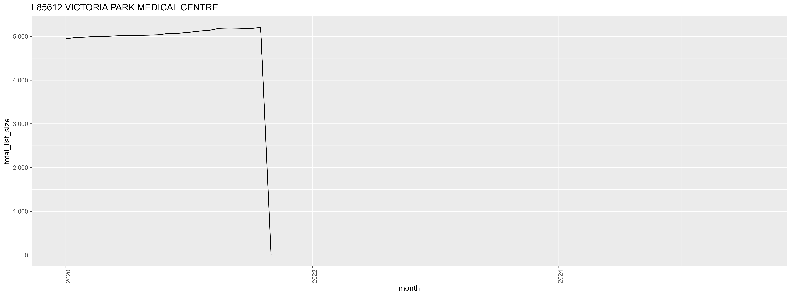
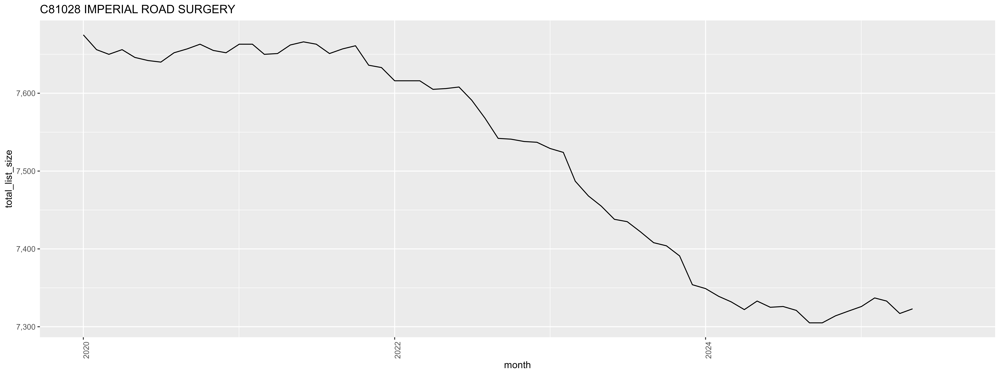
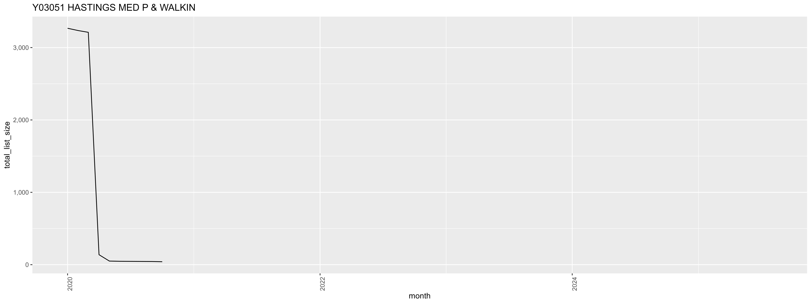
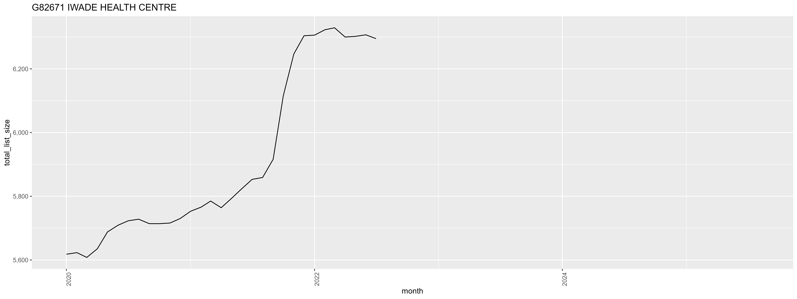
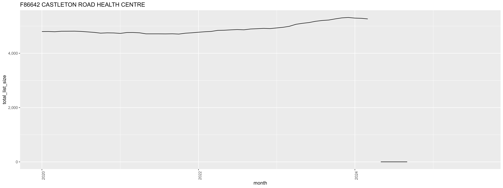

## OpenPrescibing

```{r}
#| label: load-packages
#| include: false

library(dplyr)
library(readr)
library(here)
library(glue)
library(tidyr)
library(stringr)
library(scales) ## format label_number
library(gt) ## gt table
library(ggplot2)
library(fpp2) # Forecasting: Principles and Practice" (2nd Edition)
```

NHS Digital publishes monthly and annual prescribing datasets from the NHS Business Services Authority, along with static reports on prescribing trends. However, this does not allow readers to interrogate topics of interest in detail, and the large datasets can be complex to manage. OpenPrescribing.net is a service that facilitates exploration of outliers and trends for individual general practices in NHS England. OpenPrescribing aggregates all available prescription cost analysis (PCA) data into a single data frame for longitudinal analysis of trends, to generate an interactive online service where any user can explore and monitor time trends in prescribing using the latest available data and to share all resources for reuse by others as open data. This data is available from 2010 onwards. All data is normalised to enable the exploration of prescribing trends for individual members of a class of drugs over time. To achieve this consistency, each drug is mapped to its current position in the latest BNF dictionary up to the level of its 11-character ‘product’ code through an incremental process. For every General Practice (GP) in England, the cost and quantity of dispensed prescriptions by drug is published. GP practice data is attributed to LSOA spatial units via NHS Digital’s GP practice register datasets, allowing GP-level prescribing to be approximated at neighbourhood-level. This data is not linked to patient-level data so does not allow for identification of sub-populations of interest.

The data used here is downloaded from [**OpenPrescribing**](www.openprescibing.net) using BigQuery via the notebooks in the [notebook directory](https://github.com/andrewscolm/op_indicator_saturation/blob/master/notebooks).

5 tables are queried.

-   `ebmdatalab.hscic.normalised_prescribing`

    -   practice

    -   month

    -   regional_team

    -   bnf_name

    -   chemical

    -   items

    -   quantity

-   `ebmdatalab.hscic.practices`

    -   code

    -   setting

-   `hscic.practice_statistics`

    -   month

    -   total_list_size

    -   pct_id

    -   practice

    -   name

    -   ccg_id

    -   pcn_id

    -   status_code

-   `ebmdatalab.hscic.ccg`

    -   regional_team_id

    -   code

-   `hscic.bnf`

    -   presentation_code

Data is stored in the [data](https://github.com/andrewscolm/op_indicator_saturation/blob/master/data) folder.

```{r}
#| label: import-data
#| include: false

source(here("analysis","design.R"))

label_number_n <- label_number(1, 1, big.mark=",")
label_perc_n <- label_percent(accuracy =.0001)


df_stp <- read_csv(here::here(directory_name,"prac_stps.csv")) 

###  
df_ccgs_prac <- read_csv(here::here(directory_name,"prac_ccgs.csv")) %>%
  select("code","name","stp_id", "regional_team_id","org_type") 

### list size (restricted to type 4 practices)
df_stats_prac <- read_csv(here::here(directory_name,"practice_info.csv.gz")) 

## list size (not restricted to type 4 practices)
df_stats_prac_full <- read_csv(here::here(directory_name,"practice_info_full.csv.gz")) 

## atorvastatin at regional level 
df_atorvastatin <- read_csv(here::here(directory_name,"atorvastatin_list.csv"))

## atorvastatin at practice level 
df_atorvastatin_prac <- read_csv(here::here(directory_name,"atorvastatin_practice.csv.gz"))

### regions from region team
df_regions <- read_csv(here::here("data","NHS_England_Names_and_Codes_in_England.csv")) %>%
  rename(regional_team = NHSER24CDH ,region = NHSER24NM) %>%
  select(regional_team,region)

df_atorvastatin_prac_region <- df_atorvastatin_prac %>% 
  left_join(df_stats_prac) %>%
  mutate(month =as.Date(month)) %>% 
  ungroup()

```

## Practices contributing to all months.

```{r}
#| label: all-month-filter
#| include: false

# count number of times each practice contributes 
prac_count<-df_atorvastatin_prac %>% 
    group_by(practice,month) %>% 
    summarise(practice =last(practice)) %>%
    count(practice) ## 6858

atorvastatin_practices <- df_atorvastatin_prac %>%
  group_by(practice) %>%
  summarise(practice=last(practice)) 
  
    
n_atorvastatin_practices <- atorvastatin_practices %>%
  nrow()  ## 6858


if( nrow(prac_count) != n_atorvastatin_practices){ print("Practice count does not match with above method")}

# do we lose practices in the filter?
prac_count_all_months<-prac_count %>% 
    filter(n==68) # 6,164

 id_dropped_count_all_months <- prac_count %>%
  anti_join(prac_count_all_months %>% select(practice)) %>%
  select(practice)

dropped_count_all_months <- df_atorvastatin_prac_region %>% 
  inner_join(id_dropped_count_all_months) 

dropped_count_all_months_items <-  sum(dropped_count_all_months$items)
  
df_dropped_count_all_months_list_size <- dropped_count_all_months %>%
  group_by(practice,month) %>%
  summarise(total_list_size = mean(total_list_size ,na.rm = T)) %>%
  group_by(practice) %>%
  summarise(total_list_size = sum(total_list_size ,na.rm = T))

dropped_count_all_months_list_size <-sum(df_dropped_count_all_months_list_size$total_list_size)

```

\`

`{r} label_number_n(nrow(prac_count_all_months))` of `{r} label_number_n(nrow(prac_count))` practices prescribed atorvastatin throughout the study period. `{r} label_number_n(nrow(prac_count)-nrow(prac_count_all_months))` practices will be lost by restricting to practices which prescribe every month of the study. These practices contribute `{r} label_number_n(dropped_count_all_months_items)` prescribed items and a total list size of `{r} label_number_n(dropped_count_all_months_items)` throughout the study period.

## Missing Sub ICB Locations

The list size, Sub ICB Location, and practice name come from the `practice_statistics` table. This table does not include information for all of the practices.

```{r}
#| label: miss-sicbl
#| echo: false
#| warning: false

### how many practices are missing sicbl code  
miss_ccg <- df_atorvastatin_prac  %>% 
  left_join(df_stats_prac) %>% 
  filter(is.na(sicbl)) # 4,415 lines with missing sicbl

miss_ccg_id <- miss_ccg %>%
  group_by(practice) %>%
  summarise(practice=last(practice)) #399 practices missing ccg (means missing list size)


```

There are `{r} label_number_n(nrow(miss_ccg_id))` practices missing from the `practice_statistics` table, contributing `{r} label_number_n(nrow(miss_ccg))` months of data. Practices are missing across all regions.

```{r}
#| label: table-miss-ccg-by-region
#| echo: false
#| warning: false
miss_ccg_by_region <- miss_ccg %>%
  group_by(practice) %>%
  summarise(practice=last(practice),
            regional_team=last(regional_team)) %>% #399 practices missing ccg (means missing list size)
  left_join(df_regions) %>%
  group_by(region) %>%
  count() %>%
  ungroup()

if( sum(miss_ccg_by_region$n) != nrow(miss_ccg_id)){ print("Practice count does not match with above method")}

gt(miss_ccg_by_region) %>%
  tab_options(table.font.size = 10,
  data_row.padding = px(1)) %>% 
    tab_style(
      style = cell_borders(
      sides = "all",
      color = "black",
      weight = px(1.5),
      style = "solid"
    ),
    locations = list(cells_body(), cells_column_labels())) 

```

## Practice Settings

The `ebmdatalab.hscic.practices` table is used to restrict the datasets to GP settings. However, this does not always perfectly restrict to typical GP practices. Further work needs to be applied in order to identify atypical practices such as special allocation scheme, specialist, urgent, asylum, pilot or nursing home practices. I used the following terms to try to identify each practice type from the practice name:

-   special allocation scheme practice
    -   "SAS"
    -   "Special Allocation"
    -   "Select care"
    -   "SPCL"
-   specialist practice
    -   "Specialist"
-   urgent care
    -   "urgent"
-   asylum practice
    -   asylum
-   pilot practice
    -   "Pilot"
-   nursing home practice
    -   "nurs"
    -   "one care"
-   Walk-in centres
    -   "walk-"
    -   "walk in"

```{r}
#| label: settings
#| include: false

setting_sas <- df_stats_prac %>%
  mutate(name=str_to_lower(name)) %>%
 filter(str_detect(name, 'sas|special allocation|select care|spcl')) %>%
 group_by(practice, name) %>%
 summarise(name = last(name),
 type= "special allocation scheme")

setting_specialist <- df_stats_prac %>%
  mutate(name=str_to_lower(name)) %>%
 filter(str_detect(name, 'specialist')) %>%
 group_by(practice, name) %>%
 summarise(name = last(name),
 type= "specialist")

setting_urgent <- df_stats_prac %>%
  mutate(name=str_to_lower(name)) %>%
 filter(str_detect(name, 'urgent')) %>%
 group_by(practice, name) %>%
 summarise(name = last(name),
 type= "urgent care")

setting_asylum <- df_stats_prac %>%
  mutate(name=str_to_lower(name)) %>%
 filter(str_detect(name, 'asylum')) %>%
 group_by(practice, name) %>%
 summarise(name = last(name),
 type= "asylum")

setting_pilot <- df_stats_prac %>%
  mutate(name=str_to_lower(name)) %>%
 filter(str_detect(name, 'pilot')) %>%
 group_by(practice, name) %>%
 summarise(name = last(name),
 type= "pilot")

setting_nursing <- df_stats_prac %>%
  mutate(name=str_to_lower(name)) %>%
 filter(str_detect(name, 'nurs|one care')) %>%
 group_by(practice, name) %>%
 summarise(name = last(name),
 type= "nursing home")

setting_walk <- df_stats_prac %>%
  mutate(name=str_to_lower(name)) %>%
 filter(str_detect(name, 'walk-|walk in')) %>%
 group_by(practice, name) %>%
 summarise(name = last(name),
 type= "walk-in")

### get highest total_list_size
high_list_size <- df_stats_prac %>%
 group_by(name) %>%
 summarise(name =str_to_lower(last(name)),
 highest_list_size = max(total_list_size ,na.rm = T))

df_setting <- setting_sas %>%
  bind_rows(setting_specialist) %>%
  bind_rows(setting_urgent) %>%
  bind_rows(setting_asylum) %>%
  bind_rows(setting_pilot) %>%
  bind_rows(setting_nursing) %>%
  bind_rows(setting_walk) %>%
  left_join(high_list_size) %>% 
  ungroup()


```

In total, we identified `{r} nrow(df_setting)` atypical practices. This comprised `{r} nrow(setting_sas)` special allocation scheme practices, `{r} nrow(setting_specialist)` specialist scheme practice,`{r} nrow(setting_urgent)` urgent care practice, `{r} nrow(setting_asylum)` asylum practice, `{r} nrow(setting_pilot)` pilot scheme practice and `{r} nrow(setting_nursing)` nursing home practice. Filtering practices by a minimum list size is sometimes used to remove these atypical practices. The following table contains the maximum list size of each identified atypical practice during the study period.

```{r}
#| label: table_settings
#| echo: false
#| warning: false


df_setting %>%
  gt() %>%
  cols_label(highest_list_size = "maximum list size") %>%
  tab_options(table.font.size = 10,
  data_row.padding = px(1)) %>%
    tab_style(
      style = cell_borders(
      sides = "all",
      color = "black",
      weight = px(1.5),
      style = "solid"
    ),
    locations = list(cells_body(), cells_column_labels())) %>% tab_style(
      style = cell_borders(
      sides = "all",
      color = "black",
      weight = px(1.5),
      style = "solid"
    ),
    locations = list(cells_body(), cells_column_labels())) 


```

## Practices lost when filtering to 20mg.

Practices are only included if they have am atorvastatin prescription for the month in question. How many practices are lost when we filter from all atorvastatin prescriptions to just 20mg presriptions?

```{r}
#| label: 20mg-filter
#| include: false

# filter to 20
df_atorvastatin_prac_20 <- df_atorvastatin_prac %>%
  filter(str_detect(bnf_name, '20')) 

# do we lose practices in the filter?
atorvastatin_20_practices <- df_atorvastatin_prac_20 %>%  
  group_by(practice) %>%
  summarise(practice=last(practice)) 


n_atorvastatin_20_practices <- atorvastatin_20_practices %>%
  nrow() ## 6845, (n_atorvastatin_practices 6858)


### identify lost practices
id_ator_lost_list <- atorvastatin_practices %>% 
  anti_join(atorvastatin_20_practices)

```

Over the entire study period there are `{r} label_number_n(n_atorvastatin_practices)` prescribing atorvastatin, with `{r} label_number_n(n_atorvastatin_20_practices)` prescribing 20mg strength. We lose `{r} n_atorvastatin_practices - n_atorvastatin_20_practices` practices by restricting to 20mg prescriptions. The practices dropped are as follows:

```{r}
#| label: table-20mg-filter
#| echo: false
#| warning: false

## table of practices lost when filtered to 20mg
df_ator_lost_list <- id_ator_lost_list %>%
  left_join(df_stats_prac_full) %>%
  group_by(practice) %>%
  summarise(prac_name = last(name),
            sicbl=last(sicbl)) %>%
  left_join(df_ccgs_prac,by=join_by(sicbl ==code)) %>%
  left_join(df_regions,by=join_by(regional_team_id ==regional_team )) %>%
  select(practice,prac_name,sicbl,name,regional_team_id,region) %>%
  ungroup()

gt(df_ator_lost_list) %>%
  sub_missing(missing_text = "-") %>%
  tab_options(table.font.size = 10,
  data_row.padding = px(1)) %>% 
    tab_style(
      style = cell_borders(
      sides = "all",
      color = "black",
      weight = px(1.5),
      style = "solid"
    ),
    locations = list(cells_body(), cells_column_labels())) 

```

## Compare region and practice tables

```{r}
#| label: compare-to-monthly
#| echo: false
#| warning: false
#### pratice per month (combines all items per practice per month)
df_atorvastatin_prac_month <- df_atorvastatin_prac %>%
  left_join(df_stats_prac) %>%
  group_by(month,practice) %>%
  summarise(
            items=sum(items),
            total_list_size=mean(total_list_size, na.rm = TRUE),
            regional_team = last(regional_team ),
            sicbl = last(sicbl),
            rate = items / total_list_size *1000)  %>%
  ungroup() %>%
  mutate(month = as.Date(month))


### compare practice to region dfs
### 
df_atorvastatin_chem <- df_atorvastatin %>%
  # filter(str_detect(bnf_name, '20')) %>%
  group_by(month,regional_team) %>%
  summarise(items=sum(items),
            total_list_size=mean(total_list_size),
            rate = items / total_list_size *1000)  %>%
  ungroup() 


df_atorvastatin_prac_compare <- df_atorvastatin_prac_month %>%
  ungroup() %>%
  group_by(month,regional_team) %>%
  summarise(items=sum(items),
            total_list_size=sum(total_list_size, na.rm = TRUE),
            rate = items / total_list_size *1000) %>%
  select(month,regional_team,items,total_list_size,rate) %>%
  ungroup() %>%
  full_join(df_atorvastatin_chem,by=join_by(month,regional_team)) %>%
  mutate(items= items.x-items.y,
         total_list_size = total_list_size.x-total_list_size.y)
       ##### difference in list size not in items ### list sometimes more / sometimes less

if( min(df_atorvastatin_prac_compare$items,na.rm = T) != 0 | max(df_atorvastatin_prac_compare$items,na.rm = T) ){ print("Items are not equal between regional and practice data")}

```

## Changing region

### SICBL changing regions

Sub-ICB locations (SICBL) can be identified via 2 different columns in the `practice_statistics` dataset. `ccg_id` (renamed `sicbl` in this dataset) is static and shows the SICBL as of (??Date??). `stp_id` shows the SICBL as it was at the time. Using the `stp_id`.

The difference in population between the `pct_id` and `ccg_id` definition of SICBL can be seen when plotting the list size per month for each region. In the `pct_id` plot there is a dip in list size in the North West in June 2022, corresponding to a rise in Midlands.

```{r}
#| label: figure-list-size-season-pct
#| echo: false
#| warning: false
#| fig.width: 30
#| fig.height: 10


### season plot list sizes
# 

regions<-unique(df_regions$regional_team)
  
season_pct<-df_stats_prac %>%
  left_join(df_ccgs_prac,by=join_by(pct_id ==code)) %>% 
  group_by(month,regional_team_id) %>%
  summarise(
    total_list_size=sum(total_list_size, na.rm = TRUE))  %>%
  left_join(df_regions,by=join_by(regional_team_id ==regional_team )) %>%
  ungroup() %>%
  arrange(month)

for(i in regions){
  
  
  assign(glue("season_plot_total_list_size_{df_regions %>% filter(regional_team == i) %>% select(region)}"),   assign(glue("season_plot_{i}"), ggseasonplot(ts(season_pct %>% filter(regional_team_id == i) %>% select(total_list_size), start = c(2020,01), frequency = 12),main = glue("{df_regions %>% filter(regional_team == i) %>% select(region)} list size seasonal plot"))))
  
}

seasons_combined_list_size_pct <- patchwork::wrap_plots(`season_plot_total_list_size_East of England`,`season_plot_total_list_size_London`,`season_plot_total_list_size_Midlands`, `season_plot_total_list_size_North East and Yorkshire`,
                                                    `season_plot_total_list_size_North West`,`season_plot_total_list_size_South East`,`season_plot_total_list_size_South West`)


ggsave(
  filename = here::here(
    "output",
    "data_check",
    "atorvastatin",
    glue("list_size_seasons_pct.png")),
  seasons_combined_list_size_pct,
  dpi = 600,
  width = 40,
  height = 15,
  units = "cm"
)

seasons_combined_list_size_pct

```

However, we do not see the same dip in the `ccg_id` plot.

```{r}
#| label: figure-list-size-season-sicbl
#| echo: false
#| warning: false
#| fig.width: 30
#| fig.height: 10


### season plot list sizes
# 
 
season_sicbl<-df_stats_prac %>%
  left_join(df_ccgs_prac,by=join_by(sicbl ==code)) %>% 
  group_by(month,regional_team_id) %>%
  summarise(
            total_list_size=sum(total_list_size, na.rm = TRUE))  %>%
  left_join(df_regions,by=join_by(regional_team_id ==regional_team )) %>%
  ungroup() %>%
  arrange(month)


for(i in regions){
  
  
  assign(glue("season_plot_total_list_size_{df_regions %>% filter(regional_team == i) %>% select(region)}"),   assign(glue("season_plot_{i}"), ggseasonplot(ts(season_sicbl %>% filter(regional_team_id == i) %>% select(total_list_size), start = c(2020,01), frequency = 12),main = glue("{df_regions %>% filter(regional_team == i) %>% select(region)} list size seasonal plot"))))
  
}

seasons_combined_list_size_sicbl <- patchwork::wrap_plots(`season_plot_total_list_size_East of England`,`season_plot_total_list_size_London`,`season_plot_total_list_size_Midlands`, `season_plot_total_list_size_North East and Yorkshire`,
                                                    `season_plot_total_list_size_North West`,`season_plot_total_list_size_South East`,`season_plot_total_list_size_South West`)


ggsave(
  filename = here::here(
    "output",
    "data_check",
    "atorvastatin",
    glue("list_size_seasons_sibl.png")),
  seasons_combined_list_size_sicbl,
  dpi = 600,
  width = 40,
  height = 15,
  units = "cm"
)

seasons_combined_list_size_sicbl


```

```{r}
#| label: ccg-region-change
#| echo: false
#| warning: false

### practice region from CCG (sicbl)
df_stats_prac_region_ccg <- df_stats_prac %>%
  left_join(df_ccgs_prac,by=join_by(sicbl ==code)) 

### sicbl which change region (pct_id)
sicbl_change<-df_stats_prac_region_ccg %>% 
  group_by(pct_id,regional_team_id) %>%
  summarise(pct_id = last(pct_id),
            regional_team_id = last(regional_team_id)) %>% 
  count(pct_id) %>% 
  filter(n>1)
                
```

Practices from `{r}  nrow(sicbl_change)` SICBL change region during the study period.

```{r}
#| label: table-ccg-region-change
#| echo: false
#| warning: false

##### ignore this. Multiple practices in sicbl some change some don't
# sicbl_change_regions <- sicbl_change %>%
#   left_join(df_stats_prac_region_ccg %>% 
#               group_by(pct_id,regional_team_id) %>%
#               arrange(month) %>%
#               summarise(pct_id = last(pct_id),
#                         regional_team_id = last(regional_team_id),#
#                         month = last(month))) %>%
#   arrange(pct_id, month) %>%
#   mutate(counter = row_number(pct_id),
#          direction = case_when(counter ==1 ~ "From",
#                                counter ==2 ~ "To")) %>%
#   left_join(df_regions,by = join_by(regional_team_id ==regional_team)) %>%
#   select(pct_id,direction,region) %>%
#   pivot_wider(names_from = direction, values_from = region) %>%
#   ungroup()

# gt(sicbl_change_regions)
```

### Practices changing region

```{r}
#| label: practice-region-change
#| echo: false
#| warning: false

### practice region from CCG (sicbl)
df_stats_prac_region_pct_id <- df_stats_prac %>%
  left_join(df_ccgs_prac,by=join_by(pct_id ==code)) 

### practices which change region (pct_id)
practice_change<-df_stats_prac_region_pct_id %>% 
  group_by(practice,regional_team_id) %>%
  summarise(practice = last(practice),
            regional_team_id = last(regional_team_id)) %>% 
  count(practice) %>% 
  filter(n>1)

practice_change_regions <- practice_change %>%
    left_join(df_stats_prac_region_pct_id %>% 
  group_by(practice,regional_team_id) %>%
  arrange(month) %>%
  summarise(practice = last(practice),
            regional_team_id = last(regional_team_id),
            stp_id = last(stp_id),
            sicbl_name = last(name.y),
            pct_id =last(pct_id),
            month = last(month))) %>%
                arrange(practice, month) 

### df_stp previously loaded from prac_stps.csv 
tab_practice_change_regions <-  practice_change_regions  %>%
                mutate(counter = row_number(practice),
                direction = case_when(counter ==1 ~ "From",
                counter ==2 ~ "To")) %>%
                left_join(df_regions,by = join_by(regional_team_id ==regional_team)) %>%
                left_join(df_stp,by=join_by(stp_id==code)) %>%
                select(practice,direction,region,name,sicbl_name,pct_id,month) %>%
                pivot_wider(names_from = direction, values_from = c(region,name,sicbl_name,pct_id,month)) %>%
                select(-month_To) %>%
  ungroup()              
                
```

There were `{r} length(tab_practice_change_regions$practice)` practices, from `{r} length(unique(tab_practice_change_regions$sicbl_name_To))` Integrated Care Boards (ICB), which changed region during the study period.

```{r}
#| label: table-practice-region-change
#| echo: false
#| warning: false
               


gt(tab_practice_change_regions) %>%
  cols_label(
    name_From = "from",
    sicbl_name_From = "from",
    pct_id_From = "from",
    region_From = "from",
    name_To = "to",
    sicbl_name_To = "to",
    pct_id_To = "to",
    region_To = "to",
    month_From = "Date of change"
  ) %>%
     tab_spanner(
    label = "ICB",
    columns = starts_with("name")
  )  %>%
     tab_spanner(
    label = "SICBL",
    columns = starts_with("sicbl_name")
  )  %>%
     tab_spanner(
    label = "SICBL code",
    columns = starts_with("pct_id")
  )  %>%
     tab_spanner(
    label = "Region",
    columns = starts_with("region")
  ) %>%
  tab_options(table.font.size = 10,
  data_row.padding = px(1)) %>% 
    tab_style(
      style = cell_borders(
      sides = "all",
      color = "black",
      weight = px(1.5),
      style = "solid"
    ),
    locations = list(cells_body(), cells_column_labels())) 
```

In order to investigate if the practices change list size when they move region I plotted the list size by month.

```{r}
#| label: figure-practice-region-change
#| echo: false
#| warning: false
               
id_practice_change_regions <-  practice_change_regions  %>%
                mutate(counter = row_number(practice)) %>%
                filter(counter=="1") %>%
                select(practice,month) %>% 
                mutate(month =as.Date(month)) %>% 
  ungroup()


for(prac in id_practice_change_regions$practice){
     plot_practice_change_regions <- df_atorvastatin_prac_region %>% 
           filter(practice==prac) %>%
           ggplot(aes(x = month, y = total_list_size)) +
           geom_line() +
           scale_y_continuous(labels = label_comma()) +
           scale_x_date(date_breaks = "4 months") +
           theme(axis.text.x = element_text(angle =90)) +
           geom_vline(xintercept= as.Date(id_practice_change_regions %>%  
                        filter(practice==prac) %>% 
                        select(month) %>%
                        unlist())) +
                        ggtitle(glue("{prac} {df_stats_prac %>% group_by(practice) %>% summarise(name=last(name)) %>% filter(practice ==prac)%>%select(name) %>% unlist()}"))

print(plot_practice_change_regions)

  ggsave(
    filename = here::here(
      "output",
      "data_check",
      "atorvastatin",
      "practice_change_region",
      glue("practice_change_region_{prac}.png")),
    plot_practice_change_regions,
    dpi = 600,
    width = 40,
    height = 15,
    units = "cm",
    create.dir = T
  )

}

           
```

Although the practices all had large changes in list size after the change in region this could be seen as a continuation of the pattern seen before the practice change.

## Missing list sizes

```{r}
#| label: miss-list-size
#| echo: false
#| warning: false

#### practices with no list size
df_atorvastatin_nolist <- df_atorvastatin_prac_region %>%
  filter(is.na(total_list_size)) %>%
  mutate(total = sum(items))  # 25,482 items prescribed where there is no list size

n_df_atorvastatin_nolist <- df_atorvastatin_nolist %>% 
    select(total) %>% 
    unique() %>%
    unlist()

df_atorvastatin_list<-df_atorvastatin_prac_region %>%
  filter(!is.na(total_list_size)) %>%
  mutate(total = sum(items)) ## 338,154,101 items prescribed where there is a list size

n_df_atorvastatin_list <- df_atorvastatin_list %>% 
    select(total) %>% 
    unique() %>%
    unlist()

region_missing<-df_atorvastatin_nolist %>% 
  select(regional_team) %>%
  unique() #  all regions have missing list sizes


df_atorvastatin_nolist_id <- df_atorvastatin_nolist %>% 
  select(practice) %>%
  unique() # 399 practices with missing list size

# df_atorvastatin_prac_region %>%
 # right_join(df_atorvastatin_nolist_id)  ### some missing at start, some at end, some all the way
```

`{r} label_number_n(n_df_atorvastatin_nolist)` out of `{r} label_number_n(n_df_atorvastatin_list + n_df_atorvastatin_nolist)` (`{r} label_perc_n(n_df_atorvastatin_nolist/(n_df_atorvastatin_list + n_df_atorvastatin_nolist))`) items were prescribed from a practice with no associated list size. There were `{r} nrow(df_atorvastatin_nolist_id)` practices with prescriptions without an associated list size.

```{r}
#| label: figure-missing-list-sizes
#| echo: false
#| warning: false
#| fig.width: 25
#| fig.height: 12.5

### Nice graph of practices dropping in and out of list size

missing_list_size_prac <- df_atorvastatin_prac_region %>%
  group_by(month,practice) %>%
  summarise(
    items=sum(items),
    total_list_size=mean(total_list_size, na.rm = TRUE),
    regional_team= last(regional_team)) %>%
  right_join(df_atorvastatin_nolist_id) %>% 
  group_by(month,practice,) %>%
  summarise(list_size= factor(is.na(total_list_size)*1,levels =c(0,1),labels =c("items\n&\nlist size","items\nwith\nno list size")),
            regional_team= last(regional_team))


for (regional in regions){
  assign(glue("plot_missing_list_size_prac_{regional}"), missing_list_size_prac %>%
  filter(regional_team==regional) %>%
  ggplot(aes(x=month, y=practice, fill=list_size)) +
  geom_tile() +
    ggtitle(df_regions %>% filter(regional_team==regional)%>%select(region)))
}

plot_missing_list_size_prac_NA<-missing_list_size_prac %>%
  filter(is.na(regional_team)) %>%
  ggplot(aes(x=month, y=practice, fill=list_size)) +
  geom_tile() +
  ggtitle("NA")

A<-ggplot() +theme_minimal()

plot_missing_list_size_prac <- patchwork::wrap_plots(
                      plot_missing_list_size_prac_Y56,
                      plot_missing_list_size_prac_Y58,
                      plot_missing_list_size_prac_Y59,
                      plot_missing_list_size_prac_Y60,
                      plot_missing_list_size_prac_Y61,
                      plot_missing_list_size_prac_Y62,
                      plot_missing_list_size_prac_Y63,
                      plot_missing_list_size_prac_NA,
                      ncol = 7,
                      guides = "collect",
                      heights = c(1,0.1))

ggsave(
  filename = here::here(
    "output",
    "isat",
    "atorvastatin",
    glue("list_size_missingness.png")),
  plot_missing_list_size_prac,
  dpi = 800,
  width = 60,
  height = 30,
  units = "cm"
)

plot_missing_list_size_prac
```

An example of a practice that has prescribing data with no list size for a period before it has both prescribing and list size can be seen in practice `Y07040` below:

```{r}
#| label: figure-missing-list-sizes-lead-in
#| echo: false
#| warning: false
#| fig.width: 5
#| fig.height: 1
#| 
plot_prac_1<-missing_list_size_prac %>%
  filter(practice=="Y07040") %>%
  ggplot(aes(x=month, y=practice, fill=list_size)) +
  geom_tile() +
  xlim(as.Date("2020-01-01"),as.Date("2025-08-01"))
plot_prac_1

```

Practice `Y07040` is Medicus Select Care. This is an example of a Special Allocation Scheme (SAS) practice. The SAS program provides primary care services to patients who have been removed from their regular GP practice list due to violent or aggressive behavior that was reported to the police. This is not a typical GP practice.

An example of a practice that has prescribing data with no list size throughout the study period can be seen in practice `Y02666` below:

```{r}
#| label: figure-missing-list-sizes-always-missing
#| echo: false
#| warning: false
#| fig.width: 5
#| fig.height: 1
plot_prac_2<-missing_list_size_prac %>%
  filter(practice=="Y02666") %>%
  ggplot(aes(x=month, y=practice, fill=list_size)) +
  geom_tile(fill = "#00BFC4") +
  xlim(as.Date("2020-01-01"),as.Date("2025-08-01"))

plot_prac_2
```

Practice `Y07040` is Salisbury walk-in centre. As a walk in centre there is no fixed patient list. However, it is able to prescribe atorvastatin.

An example of a practice that has prescribing data with no list size for a period after it has both prescribing and list size can be seen in practice `L83642` below:

```{r}
#| label: figure-missing-list-sizes-end-out
#| echo: false
#| warning: false
#| fig.width: 5
#| fig.height: 1
plot_prac_3<-missing_list_size_prac %>%
  filter(practice=="L83642") %>%
  ggplot(aes(x=month, y=practice, fill=list_size)) +
  geom_tile() +
  xlim(as.Date("2020-01-01"),as.Date("2025-08-01"))
plot_prac_3

```

Practice `L83642` is Estover Surgery. Estover surgery closed, however, due to electronic repeat dispensing (eRD) atorvastatin may still be dispensed for 6-12 months after closing.

# "Opening" practices

```{r}
#| label: miss-start
#| echo: false
#| warning: false

miss_start<-unique(df_atorvastatin_prac_region %>% 
    filter(month=="2020-01-01") %>% 
    select(practice))


id_miss_start<-df_atorvastatin_prac_region %>%
    anti_join(miss_start) %>%
    group_by(practice) %>%    
    count(NAs = is.na(total_list_size)) %>%  ### remove practices that are always missing listsize
    arrange(practice,NAs) %>%
    filter(NAs==F) %>%
    select(practice) 

  miss_start_sas <- setting_sas %>%
    inner_join(id_miss_start) %>%
    select(practice) %>%
    unlist()

other_atypical <- df_setting %>%
  anti_join(setting_sas)

miss_start_other_atypical <- other_atypical %>%
 inner_join(id_miss_start) %>%
 select(practice) %>%
 unlist()

miss_start_just_normal_practices <- id_miss_start %>%
 anti_join(df_setting) %>%
 select(practice) %>%
 unlist()

```

I defined opening practices as practices with no atorvastatin prescribing at the start of the study period. There were `{r} nrow(id_miss_start)` practices that opened during the study period. In order to investigate if there is any pattern to opening practices I plotted their list size per month.

`{r} length(miss_start_sas)` of these practices are SAS practices.

```{r}
#| label: miss_start_sas
#| echo: false
#| warning: false
for(prac in miss_start_sas){
  plot_opening_practices <- df_atorvastatin_prac_region %>% 
           filter(practice==prac) %>%
           ggplot(aes(x = month, y = total_list_size)) +
           geom_line() +
           scale_y_continuous(labels = label_comma()) +
           scale_x_date(date_breaks = "4 months") +
           theme(axis.text.x = element_text(angle =90)) +
                        ggtitle(glue("{prac} {df_stats_prac %>% group_by(practice) %>% summarise(name=last(name)) %>% filter(practice ==prac)%>%select(name) %>% unlist()}")) +
           xlim(as.Date("2020-01-01"),as.Date("2025-08-01"))

print(plot_opening_practices)

  ggsave(
    filename = here::here(
      "output",
      "data_check",
      "atorvastatin",
      "opening_practices",
      glue("opening_practices_{prac}.png")),
    plot_opening_practices,
    dpi = 600,
    width = 40,
    height = 15,
    units = "cm",
    create.dir = T
  )

}
```

`{r} length(miss_start_other_atypical)` of these practices are specialist, urgent, asylum, pilot or nursing home practices.

```{r}
#| label: miss_start_other_atypical
#| echo: false
#| warning: false
for(prac in miss_start_other_atypical){
  plot_opening_practices <- df_atorvastatin_prac_region %>% 
           filter(practice==prac) %>%
           ggplot(aes(x = month, y = total_list_size)) +
           geom_line() +
           scale_y_continuous(labels = label_comma()) +
           scale_x_date(date_breaks = "4 months") +
           theme(axis.text.x = element_text(angle =90)) +
                        ggtitle(glue("{prac} {df_stats_prac %>% group_by(practice) %>% summarise(name=last(name)) %>% filter(practice ==prac)%>%select(name) %>% unlist()}")) +
           xlim(as.Date("2020-01-01"),as.Date("2025-08-01"))

print(plot_opening_practices)

  ggsave(
    filename = here::here(
      "output",
      "data_check",
      "atorvastatin",
      "opening_practices",
      glue("opening_practices_{prac}.png")),
    plot_opening_practices,
    dpi = 600,
    width = 40,
    height = 15,
    units = "cm",
    create.dir = T
  )

}
```

The remaining `{r} length(miss_start_just_normal_practices)` practices are correctly categorised as GP practices.

```{r}
#| label: miss_start_just_normal_practices
#| echo: false
#| warning: false
for(prac in miss_start_just_normal_practices){
  plot_opening_practices <- df_atorvastatin_prac_region %>% 
           filter(practice==prac) %>%
           ggplot(aes(x = month, y = total_list_size)) +
           geom_line() +
           scale_y_continuous(labels = label_comma()) +
           scale_x_date(date_breaks = "4 months") +
           theme(axis.text.x = element_text(angle =90)) +
                        ggtitle(glue("{prac} {df_stats_prac %>% group_by(practice) %>% summarise(name=last(name)) %>% filter(practice ==prac)%>%select(name) %>% unlist()}")) +
           xlim(as.Date("2020-01-01"),as.Date("2025-08-01"))

print(plot_opening_practices)

  ggsave(
    filename = here::here(
      "output",
      "data_check",
      "atorvastatin",
      "opening_practices",
      glue("opening_practices_{prac}.png")),
    plot_opening_practices,
    dpi = 600,
    width = 40,
    height = 15,
    units = "cm",
    create.dir = T
  )

}
```

# "Closing" practices

```{r}
#| label: miss-end
#| echo: false
#| warning: false

miss_end <- unique(df_atorvastatin_prac_region %>% 
    filter(month=="2025-07-01") %>% 
    select(practice))

id_miss_end<-df_atorvastatin_prac_region %>%
    anti_join(miss_end) %>%
    group_by(practice) %>%    
    count(NAs = is.na(total_list_size)) %>%  ### remove practices that are always missing listsize
    arrange(practice,NAs) %>%
    filter(NAs==F) %>%
    select(practice) 

 id_atypical_end <- id_miss_end %>% 
  inner_join(df_setting) %>% 
  select(practice) %>% 
  unlist()

id_miss_end <- id_miss_end %>%
  unlist()
```

Similarly, I defined closing practices as practices with no atorvastatin prescribing at the end of the study period. There were `{r} length(id_miss_end)` practices that opened during the study period. In order to investigate if there is any pattern to closing practices I plotted their list size per month.

`{r} length(id_miss_end)` of the closing practices were typical.

```{r}
#| label: miss_end_atypical
#| echo: false
#| warning: false
for(prac in id_atypical_end ){
  plot_opening_practices <- df_atorvastatin_prac_region %>% 
           filter(practice==prac) %>%
           ggplot(aes(x = month, y = total_list_size)) +
           geom_line() +
           scale_y_continuous(labels = label_comma()) +
           scale_x_date(date_breaks = "4 months") +
           theme(axis.text.x = element_text(angle =90)) +
                        ggtitle(glue("{prac} {df_stats_prac %>% group_by(practice) %>% summarise(name=last(name)) %>% filter(practice ==prac)%>%select(name) %>% unlist()}")) +
           xlim(as.Date("2020-01-01"),as.Date("2025-08-01"))

print(plot_opening_practices)

}
```

I have included a selection of the remaining plots which are indicative of 4 different patterns.

A sharp decrease in list size before closing 

Slow decrease in list size before closing 

A period of low list size before closing 

No decrease in list size before closing 

Activity after closing 

```{r}
#| label: plot-miss-end
#| echo: false
#| warning: false
#| fig.width: 30
#| fig.height: 10

for(prac in id_miss_end){
     plot_closing_practices <- df_atorvastatin_prac_region %>% 
           filter(practice==prac) %>%
           ggplot(aes(x = month, y = total_list_size)) +
           geom_line() +
           scale_y_continuous(labels = label_comma()) +
           scale_x_date(date_breaks = "4 months") +
           theme(axis.text.x = element_text(angle =90)) +
                        ggtitle(glue("{prac} {df_stats_prac %>% group_by(practice) %>% summarise(name=last(name)) %>% filter(practice ==prac)%>%select(name) %>% unlist()}")) +
  xlim(as.Date("2020-01-01"),as.Date("2025-08-01"))

  ggsave(
    filename = here::here(
      "output",
      "data_check",
      "atorvastatin",
      "closing_practices",
      glue("closing_practices_{prac}.png")),
    plot_closing_practices,
    dpi = 600,
    width = 40,
    height = 15,
    units = "cm",
    create.dir = T
  )

}

```